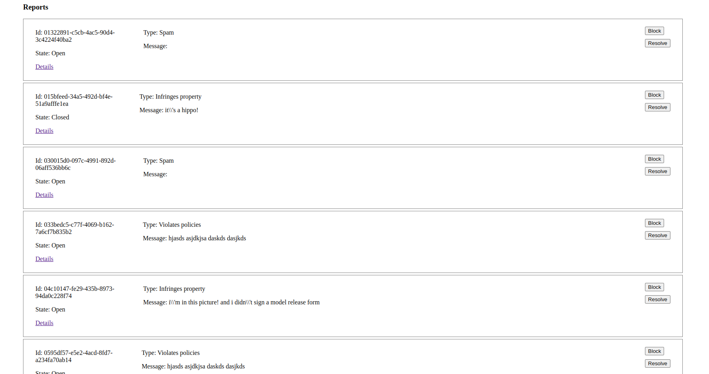

### Full-Stack Challenge from BildauDigital done by Niyobuhungiro Yves

This challenge imagines that we have a social media platform that is under attack from spam. We have implemented a reporting system for users that lets them report spam to the platform, and our spam protection team.

The challenge is to create a small full stack application for our spam protection team that consists of a server and a web based UI in order to manage reported content.

The link of this challenge https://github.com/BildauDigital/Coding-Challenge-FullStack#challenge-description

### Technologies

- php 8.0
- vuejs2
- pecee/simple-router package
- php apcu

#### Installation and Run

Note: Make sure you have composer and php 7.4+

1. Clone the repository

2. Go into the directory then run:  `composer install`

3. Install or enable php APCu

3. Then run it with `php -S localhost:8021`

Now Visit http://localhost:8021

#### Screenshoot

